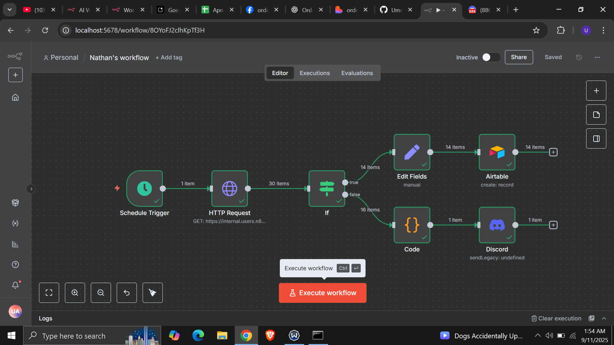

# 📝 Assignment – Class 04 (PIAIC Q1)

**Course:** PIAIC – Modern AI with Python (Quarter 1)  
**Class:** 04  
**Assignment:** Automating Orders with Airtable + Discord + n8n  
**Instructors:** Sir Aneeq & Sir Hamza  

---

## 📌 Workflow Overview  

This workflow automates **order tracking and reporting** using **n8n**, **Airtable**, and **Discord**.  

### 🔄 Steps Involved  

1. **Schedule Trigger**  
   - Workflow runs automatically every **Monday at 9 AM**.  

2. **HTTP Request**  
   - Fetches order data from a custom ERP system using an authenticated webhook request.  

3. **IF Node (Condition Check)**  
   - Checks if an order’s `orderStatus` equals `"processing"`.  
   - If **true** → Order details are processed and stored in Airtable.  
   - If **false** → Data moves to summary calculation.  

4. **Edit Fields (Set Node)**  
   - Extracts `orderID` and `employeeName` fields from incoming data.  

5. **Airtable Node**  
   - Stores new order information (`orderID`, `employeeName`, `customerID`, `orderPrice`, `orderStatus`) in Airtable.  

6. **Code Node (JavaScript)**  
   - Loops through all items.  
   - Calculates:  
     - **totalBooked** → Number of orders.  
     - **bookedSum** → Sum of all order prices.  

7. **Discord Notification**  
   - Sends a **weekly summary message** to a Discord channel via webhook.  
   - Example message:  
     ```
     This week we've 15 booked orders with a total value of $3,500.
     My Unique ID: 61cd3206c1c309eaf5bb67cc8429b268
     ```

---

## 🚀 Learning Objectives  

- Understand how to integrate **external APIs (ERP) with n8n**.  
- Learn **data validation with IF node**.  
- Automate storage in **Airtable database**.  
- Use **JavaScript in Code Node** for calculations.  
- Send real-time **reports to Discord**.  

---

## 📂 Deliverables  

- ✅ Exported workflow JSON file  
- ✅ Screenshot of Airtable after new entry  
- ✅ Screenshot of Discord notification  

### 📸 Workflow Preview  
  
---

✨ *This assignment helped us practice connecting multiple services and creating automated reports without manual work.*  
