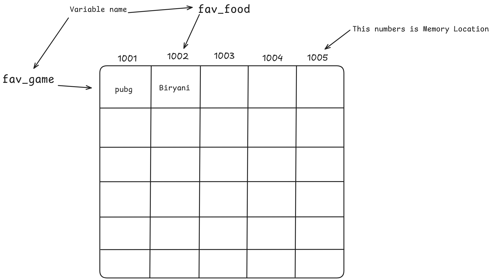
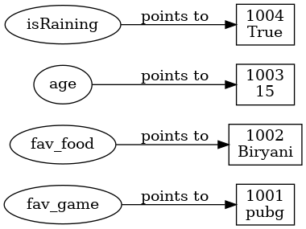

# 🧠 Class 03 – Memory & Conditional Statements  

## 📌 Topics Covered
- Variables and Memory Representation  
- `if`, `else`, `elif` statements  
- Comparison & Logical Operators  
- Class Task: Grading System with `if-elif-else`  

---

## 🗂 Memory Diagrams  

### ✍️ Hand-drawn Style (Made in Excalidraw)  
  

**Explanation:**  
Is diagram me hum dekh rahe hain ke variables (`fav_game`, `fav_food`) memory locations me store ho rahe hain.  
- `fav_game` → "pubg" ko point kar raha hai jo memory address **1001** me store hai.  
- `fav_food` → "Biryani" ko point kar raha hai jo memory address **1002** me store hai.  
Har ek variable ke liye Python ek alag memory slot allot karta hai.  

### 🤖 Auto-generated Diagram  
  

**Explanation:**  
Yeh diagram visualize karta hai ke variables aur unke values memory ke andar kis tarah link hote hain.  
- Variable ka naam ek pointer ki tarah hota hai jo **value ke address** ko point karta hai.  
- Jaise `age = 15` → `age` variable memory address (e.g., 1056729056) me **15** ko point karega.  
- Boolean (`True/False`) aur Strings (`"pubg"`, `"Biryani"`) bhi apni unique memory addresses pe stored hote hain. 

---

## 🐍 Example Code (class03.py)

```python
fav_game = "pubg"
fav_food = "Biryani"
age = True

print(fav_game, id(fav_game))

# if-else example
isRaining = True
if isRaining:
    print("School nhi Jana he")
else:
    print("School Jana he")
```

## 🚀 Assignment – Class 03

- Practice if-else and elif statements with your own examples.

- Write a program to calculate grades based on percentage.

- Draw your own memory diagram (optional but recommended).

- 👉 Full class code & assignments available in repo.
[Classs code with Percentag Task](class-03.py)